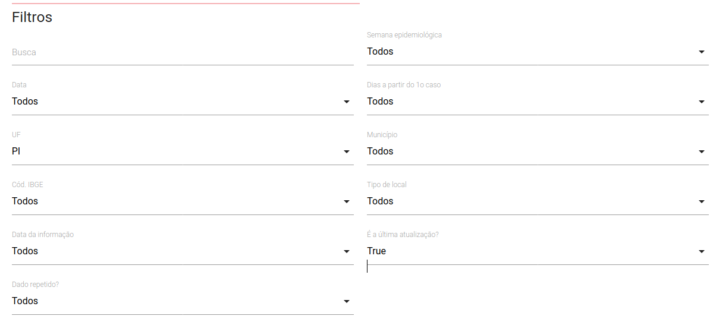

```{r knitr_init, echo=FALSE, results="asis", cache=FALSE}
library(knitr)
library(rmdformats)
library(DT)
library(readr)
library(readxl)

## Global options
options(max.print = "75")
opts_chunk$set(echo = FALSE,
	             cache = FALSE,
               prompt = FALSE,
               tidy = FALSE,
               comment = NA,
               message = FALSE,
               warning = FALSE)
opts_knit$set(width = 75)
```


# Possíveis fontes

* [Brasil IO](https://brasil.io/dataset/covid19/caso_full/) tem diversas informações, estas adquiridas das secretarias estaduais de cada estado. Ver imagem abaixo para como obter os dados no formato *csv*.


**Nota**: O filtro "É a última atualização" só precisa ser *True* caso deseje obter apenas os dados relativos ao último dia.

* [Governo do Piauí](http://coronavirus.pi.gov.br/) apresenta um website bem estruturado e de fácil aquisição de informação epidemiológica, para baixar os dados no formato *excel*, basta descer a página até encontrar o botão "Exportar".

* [Ministério da Saúde - Notificações](https://opendatasus.saude.gov.br/organization/ministerio-da-saude) com todos seus defeitos, ainda apresenta informações interessantes. Para coisas como contagem de casos e distribuição municipal eu recomendo os dados acima, mas caso tenha interesse em verificar notificações de casos suspeitos de COVID-19, o ministério tem organizado o [dado do e-SUS NOTIFICA](https://opendatasus.saude.gov.br/dataset/casos-nacionais) que está dividido por estado e possui informações sobre os indivíduos, como sexo, idade e ocupação.

  > Vou logo avisando que o dado do ministério, apesar de ter informação valiosa, possui inconsistências e erros de formatação que podem dificultar a utilização dele.
  
* [Ministério da Saúde - Insumos](https://covid-insumos.saude.gov.br/paineis/insumos/painel.php) é um painel que possui informações sobre disponibilidade de insumos hospitalares em cada estado.

# Dados

Aqui você pode encontrar tabelas interativas das fontes de dados consideradas, sinta-se a vontade pra baixar ou copiar, porém citando as fontes originais.

## Tabelas {.tabset .tabset-fade .tabset-pills}

```{r data-acq}
pi_data <- file.path(tempdir(), "govpi_data.xlsx")
ins_data <- file.path(tempdir(), "ins.csv")

download.file("http://coronavirus.pi.gov.br/public/export/export.xlsx", pi_data)
download.file("https://covid-insumos.saude.gov.br/paineis/insumos/lista_csv_painel.php?output=csv", ins_data)

st_pi <- read_excel(pi_data, sheet = 1)

muns_pi <- read_excel(pi_data, sheet = 2)

ins <- read_csv2(ins_data) %>% 
  tidyr::pivot_longer(-uf, names_to = "Insumo", values_to = "Número") %>% 
  dplyr::filter(uf == "PI")
```

### Gov. do Piauí - ST

Esse dado, presente na primeira planilha fornecida pelo Gov. do Piauí, apresenta uma série temporal dos casos.


```{r eval=TRUE}
datatable(
  st_pi,
  extensions = 'Buttons', options = list(
    dom = 'Bfrtip',
    buttons = 
      list('copy', list(
        extend = 'collection',
        buttons = c('csv', 'excel', 'pdf'),
        text = 'Download'
      ))
    
  )
)
```


### Gov. do Piauí - Municipal

Dado presente na segunda planilha do governo. Informações acumuladas a nível de município.

```{r eval=TRUE}
datatable(
  muns_pi,
  extensions = 'Buttons', options = list(
    dom = 'Bfrtip',
    buttons = 
      list('copy', list(
        extend = 'collection',
        buttons = c('csv', 'excel', 'pdf'),
        text = 'Download'
      ))
    
  )
)
```

### eSUS - NOTIFICA

Infelizmente a tabela é um pouco grande pra exibir aqui e não quero filtrá-la a risco de perder alguma informação valiosa pra você. Mas não há problema, basta clicar [aqui](https://s3-sa-east-1.amazonaws.com/ckan.saude.gov.br/dados-pi.csv) para baixá-la!

### Insumos hospitalares

Fiz uma pequena alteração no dado pra caber na página, mas você pode adquirir o dado original no link da página anterior.

```{r eval=TRUE}
datatable(
  ins,
  extensions = 'Buttons', options = list(
    dom = 'Bfrtip',
    buttons = 
      list('copy', list(
        extend = 'collection',
        buttons = c('csv', 'excel', 'pdf'),
        text = 'Download'
      ))
    
  )
)
```

### Brasil IO

A interface deles fornece melhor manipulação, então [vai lá](https://brasil.io/dataset/covid19/caso_full/)!